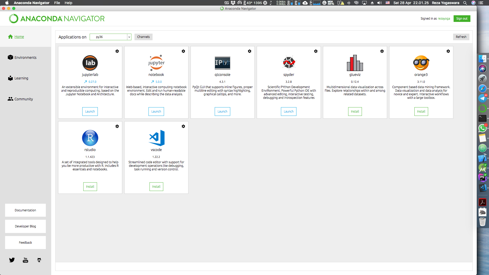
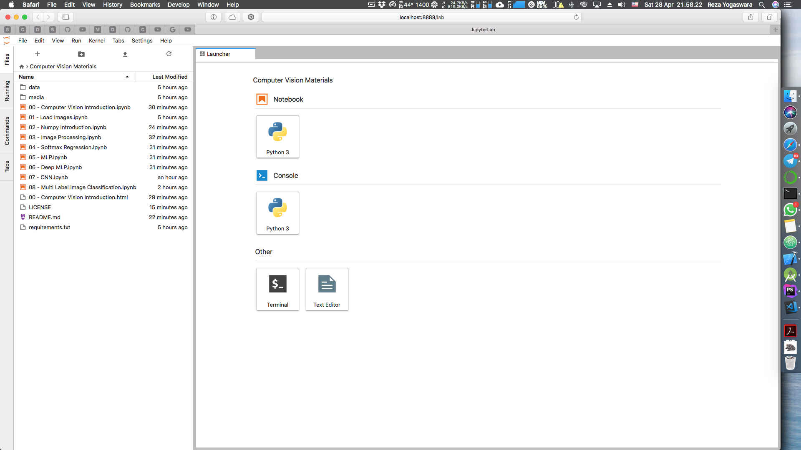
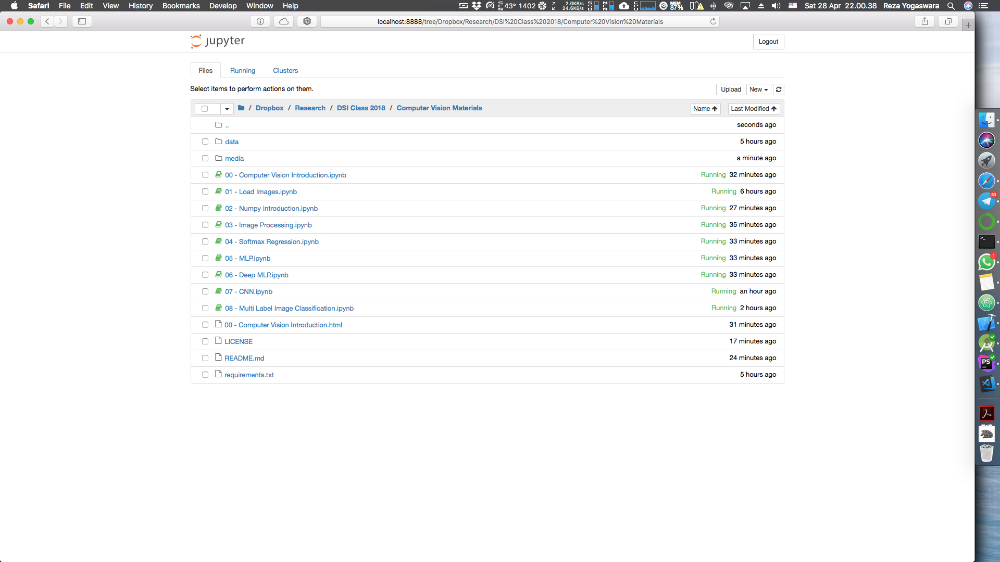

# Computer Vision With Python
> Belajar Computer Vision menggunakan Python

## Prerequisites
- Pernah menggunakan `Python, R, Java, Matlab, bahasa pemrograman lainnya atau bahkan Excel (I'm not a Python geek)`, setidaknya anda pernah membuat ```Fibonacci Sequence```  dengannya, yang sudah termasuk didalamnya `Logical and Structured Thinking`
- Memahami konsep sederhana `Data structure`
- Memahami konsep sederhana `Aljabar linear`

## Pemasangan (Installation) dan Penggunaan Pertama
Silahkan download [Anaconda](https://anaconda.com/download). Install sesuai dengan sistem operasi masing - masing. Setelah itu clone / download repositori ini ke folder anda inginkan.

## Menggunakan Anaconda Navigator
- MacOS dan Linux:
   - Buka terminal, kemudian ketik

```sh
$ anaconda-navigator
```

- Windows:
    - Buka launcher windows, kemudian pilih program Anaconda Navigator

Tampilan Anaconda Navigator akan seperti ini.



Silahkan launch jupyter lab / jupyter notebook kemudian navigasi ke folder yang telah anda simpan.

## Menggunakan Terminal atau Anaconda Prompt
- MacOS dan Linux:
   - Buka terminal, kemudian ketik

```sh
$ jupyter-lab
```

atau

```sh
$ jupyter notebook
```

- Windows:
   - Buka Anaconda Prompt, kemudian ketik

```sh
C:\> jupyter-lab    
```

atau

```sh
C:\> jupyter notebook   
```

Kemudian navigasi ke folder yang telah anda simpan.

## Library Python yang digunakan
Silakan lihat `` requirements.txt ``.

## Tampilan Jupyter-lab


## Tampilan Jupyter Notebook


## Dataset
- Dataset yang digunakan: The MNIST Database of handwritten digits [bisa dilihat disini](http://yann.lecun.com/exdb/mnist/)

## Inspirasi
Materi repositori ini terinspirasi dari beberapa repository pembelajaran Computer Vision dan Image Processing.

## Lisensi
Didistribusikan menggunakan lisensi MIT. Silahkan melihat `` LICENSE `` untuk lebih lanjut

## Kontribusi
1. Silahkan di Fork  
2. Buat branch baru (`git checkout -b feature/baz`)
3. Silahkan isi nama anda beserta tautan github anda di CONTRIBUTORS.md
4. Commit perubahan yang ada(`git commit -am 'Add some baz'`)
5. Push pada branch yang sudah ada (`git push origin feature/baz`)
6. Buat sebuah Pull Request baru
